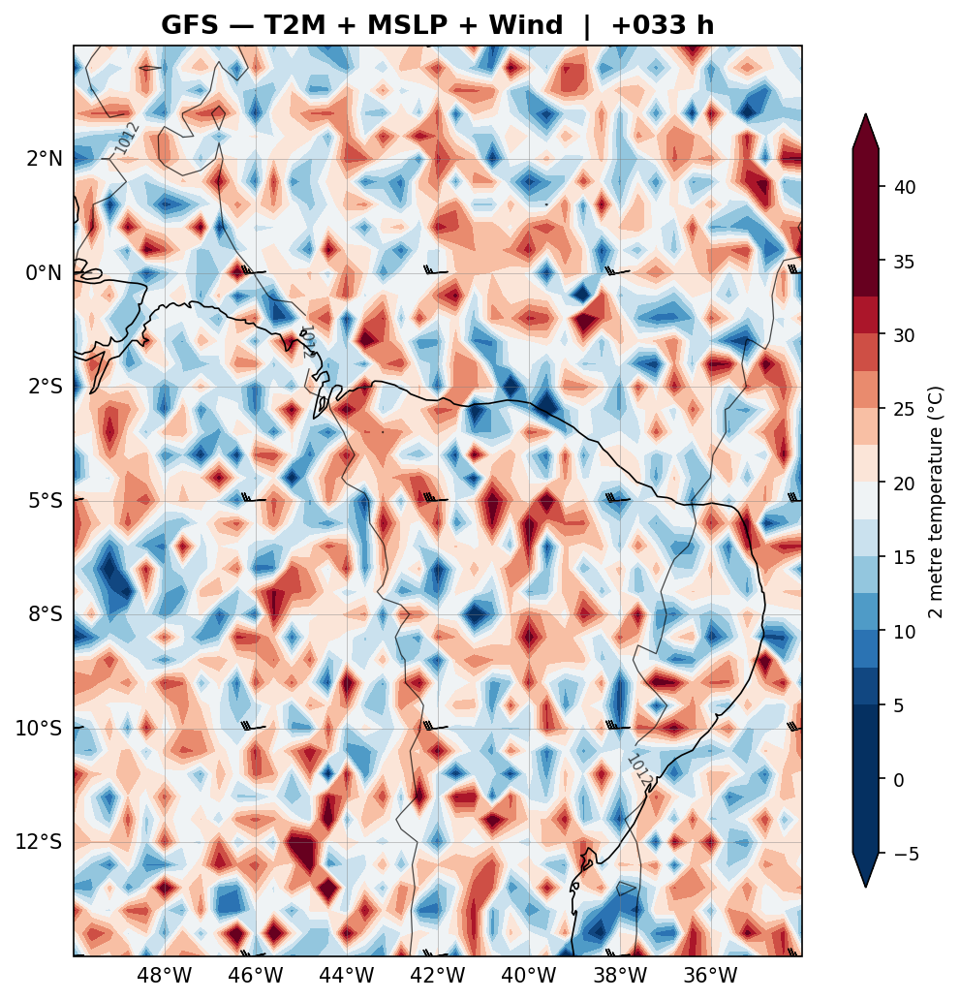
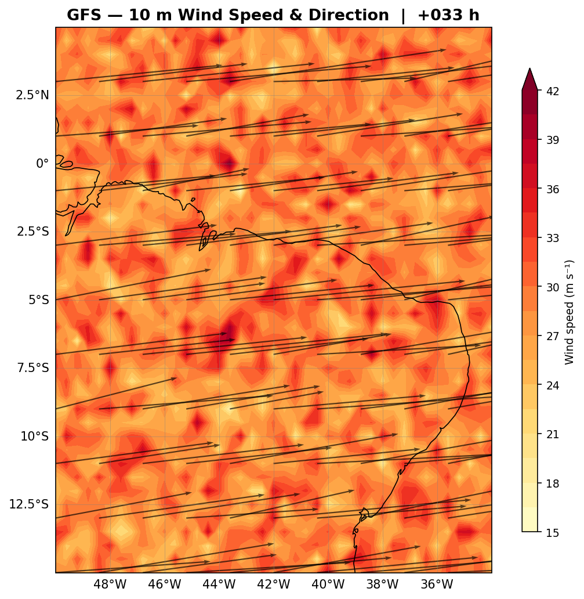
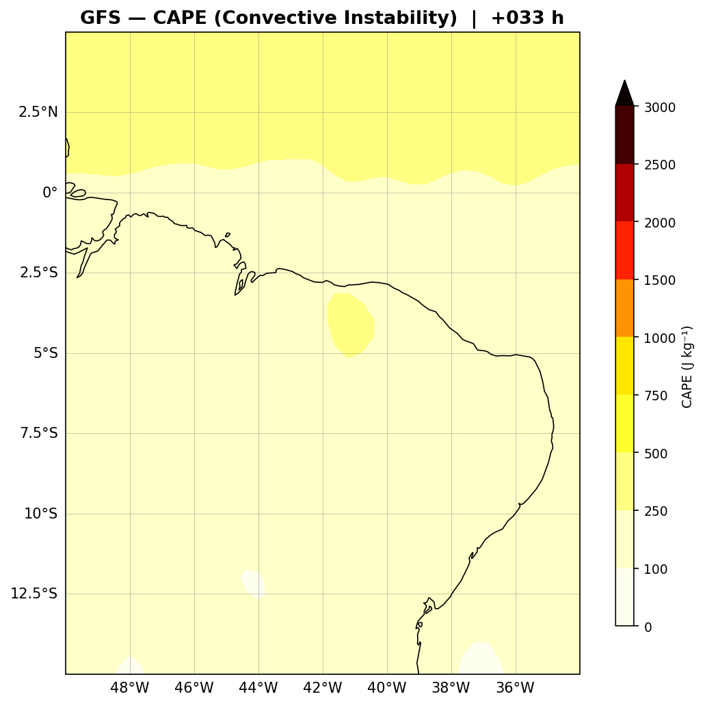
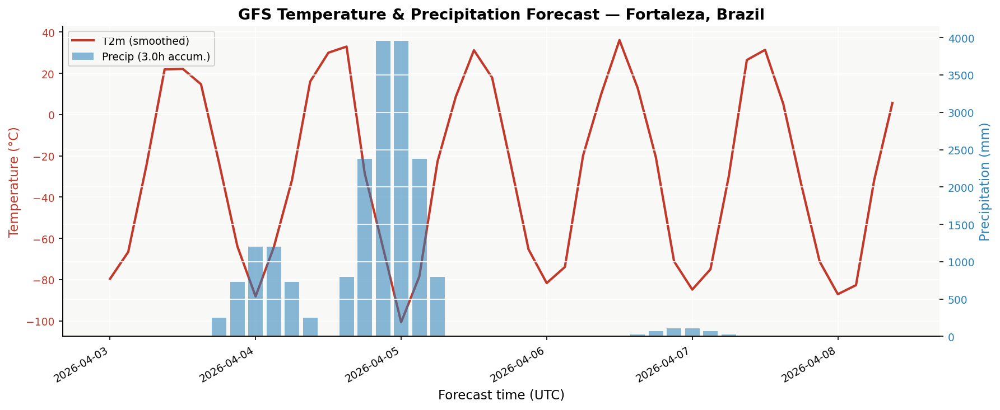
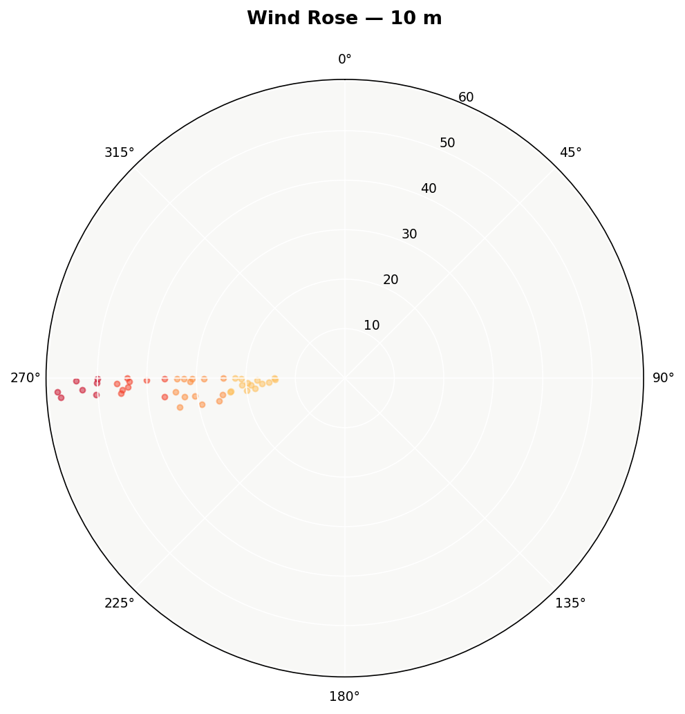
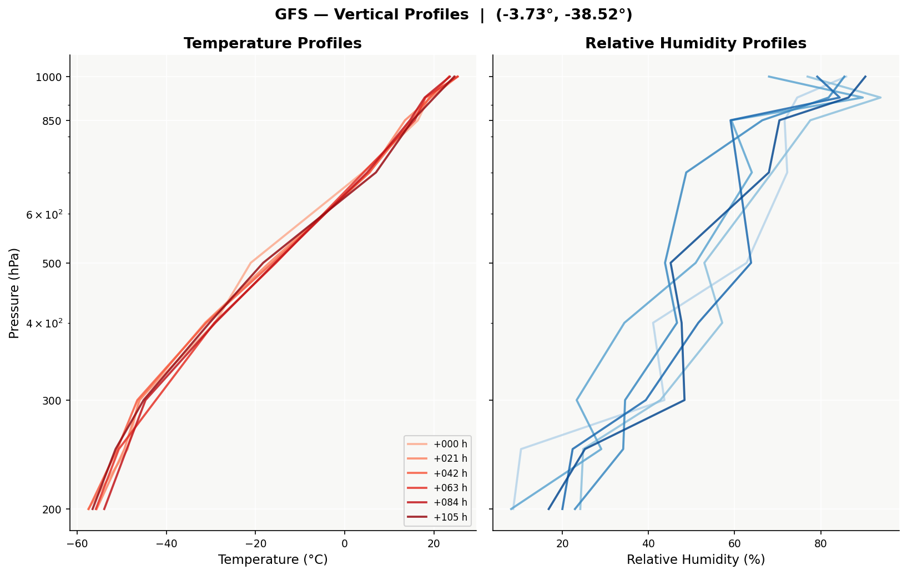
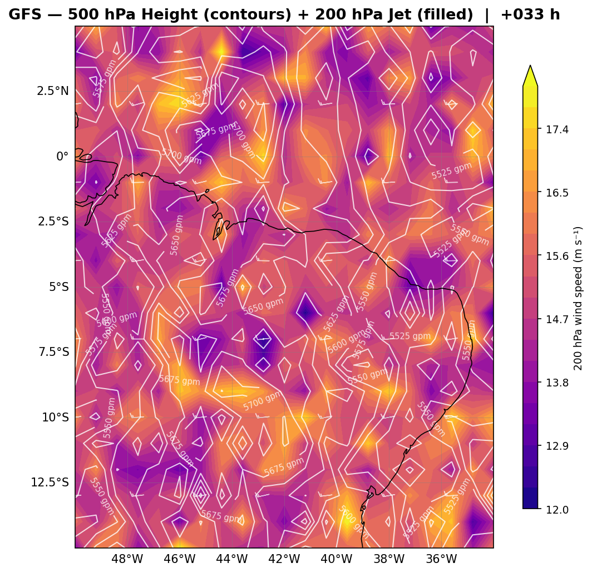
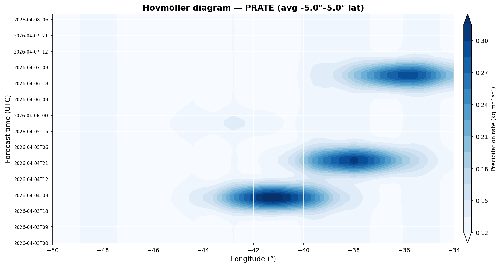
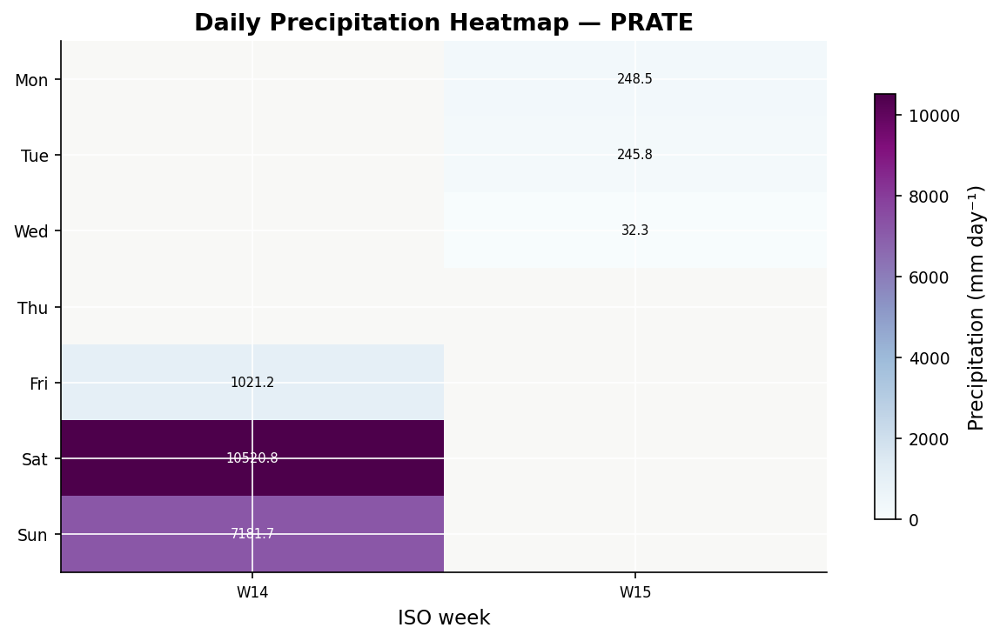
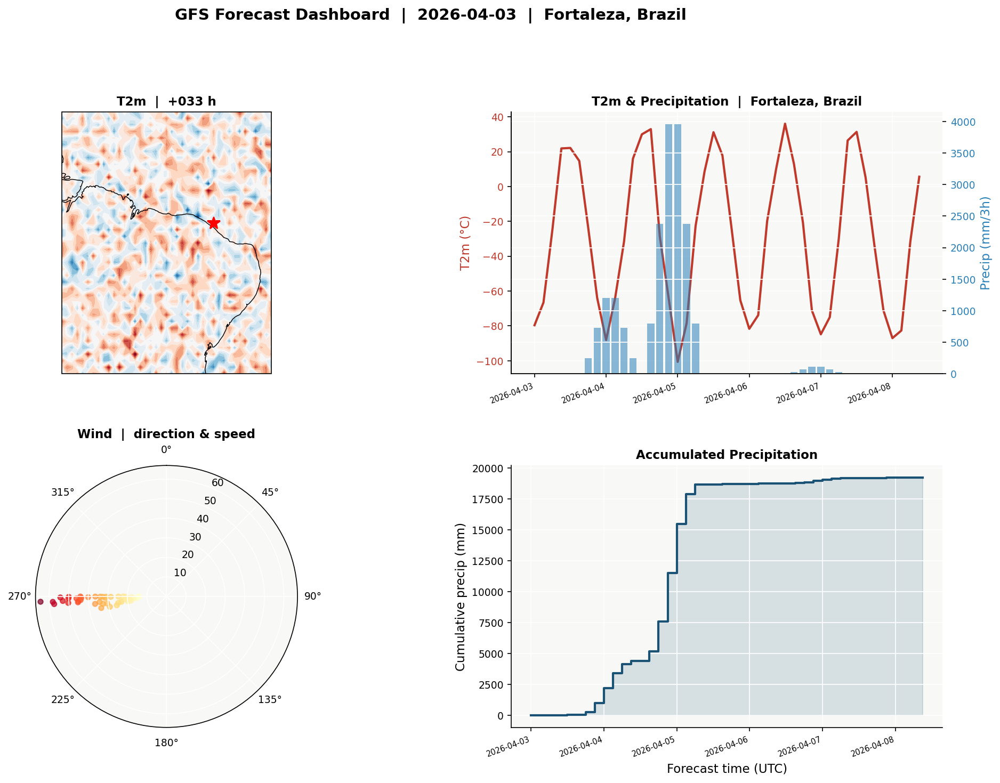

# noawclg

> **Download, analyse and visualise NOAA atmospheric and ocean data in Python.**


[](https://pypi.org/project/noawclg/)
[](https://pypi.org/project/noawclg/)
[](LICENSE)
[](https://noawclg.readthedocs.io)

`noawclg` gives you a clean Python API over two major NOAA data streams —
**GFS weather forecasts** and **GODAS/ERSST ocean analyses** — returning
`xarray.Dataset` objects ready for analysis and plotting.

---

## Features

| | |
|--|--|
| **GFS forecasts** | 3-hourly, 0–384 h, surface + multi-level, GRIB2 via NOMADS |
| **GODAS ocean** | `pottmp` · `salt` · `ucur` · `vcur` · `sshg` · 40 depth levels · 1980–present |
| **ERSST v5** | SST back to 1854 · long climatologies via OPeNDAP |
| **ENSO diagnostics** | ONI · Niño indices · D20 thermocline · WWV · phase classification |
| **26 plot functions** | Synoptic maps · globe · ENSO time series · thermocline sections · wind rose |
| **No API key** | All data via public OPeNDAP / NOMADS endpoints |

---

## Installation

```bash
pip install noawclg                   # core
pip install "noawclg[plots]"          # + cartopy, metpy, windrose, seaborn
```

---

## Quick start

### GFS forecast

```python
from noawclg import load, auto_date

date, cycle = auto_date(lag_days=1)
ds = load(
    date=date, cycle=cycle,
    lat=-3.7, lon=-38.5,                         # Fortaleza, Brazil
    region={"toplat": 5, "bottomlat": -15,
            "leftlon": -50, "rightlon": -30},
    hours=list(range(0, 49, 3)),
)

from plots import plot_synoptic_map
plot_synoptic_map(ds, hour=24, save_path="synoptic.png")
```

### Ocean data at 200 m

```python
from noawclg import get_ocean_temp, get_salinity, get_currents, get_ssh

t200 = get_ocean_temp(2024, depth_m=200)         # °C  (12, lat, lon)
sal  = get_salinity(2024, depth_m=5)             # PSU (12, lat, lon)
curr = get_currents(2024, depth_m=5)             # Dataset: ucur, vcur, speed
ssh  = get_ssh(2024)                             # m   (12, lat, lon)
```

### ENSO monitoring

```python
from noawclg import enso_summary, get_oni, classify_enso
from plots import plot_enso_index

df  = enso_summary(2015, 2024)
oni = get_oni(2015, 2024)
fig = plot_enso_index(oni, classify_enso(oni), save_path="oni.png")
```

### Globe plot

```python
from plots import plot_globe

plot_globe(
    t200.mean("time"),
    title="Mean Ocean Temperature at 200 m — 2024",
    cmap="RdYlBu_r",
    central_longitude=-150,
    save_path="globe.png",
)
```

---

## Module overview

```
noawclg/
├── catalog.py      — GFS variable catalogue and hour sequences
├── coords.py       — BoundingBox, auto_date
├── gfs_dataset.py  — GFSDatasetManager (download, build, cache)
├── http.py         — low-level GRIB2 download via NOMADS
├── load.py         — noawclg.load() one-liner wrapper
├── ocean.py        — GODAS / ERSST: temperature, salinity,
│                     currents, SSH, ENSO indices, WWV, D20
├── persistence.py  — NetCDF4 / Zarr save and load
├── query.py        — get_noaa_data() high-level interface
└── view.py         — dataset inspection helpers

plots.py            — 26 plot functions (GFS + ocean/ENSO)
make_readme_plots.py— generates the gallery below with synthetic data
```

---

## Documentation

Full documentation, API reference and examples are on **ReadTheDocs**:

**[noawclg.readthedocs.io](https://noawclg.readthedocs.io)**

Topics covered:
- [Installation](https://noawclg.readthedocs.io/en/latest/installation.html)
- [Quick start](https://noawclg.readthedocs.io/en/latest/quickstart.html)
- [GFS basics](https://noawclg.readthedocs.io/en/latest/examples/gfs_basics.html)
- [ENSO analysis](https://noawclg.readthedocs.io/en/latest/examples/enso_analysis.html)
- [Maps & globe plots](https://noawclg.readthedocs.io/en/latest/examples/maps_globe.html)
- [API reference](https://noawclg.readthedocs.io/en/latest/api/index.html)

---

## Plot gallery

Generated with `python make_readme_plots.py` using synthetic GFS data.

<table>
<tr>
<td align="center" width="50%">
<b>Synoptic surface map</b><br>
<sub>T2m · MSLP isobars · 10 m wind barbs</sub><br>

</td>
<td align="center" width="50%">
<b>Wind speed map</b><br>
<sub>10 m wind speed fill + barbs</sub><br>

</td>
</tr>
<tr>
<td align="center">
<b>CAPE map</b><br>
<sub>Convective Available Potential Energy</sub><br>

</td>
<td align="center">
<b>Forecast time series</b><br>
<sub>T2m · dew point · MSLP · precipitation</sub><br>

</td>
</tr>
<tr>
<td align="center">
<b>Wind rose</b><br>
<sub>Frequency by direction and speed category</sub><br>

</td>
<td align="center">
<b>Vertical profiles</b><br>
<sub>T + RH vs pressure at several forecast times</sub><br>

</td>
</tr>
<tr>
<td align="center">
<b>500 hPa geopotential + jet</b><br>
<sub>Wind speed and height contours</sub><br>

</td>
<td align="center">
<b>Hovmöller diagram</b><br>
<sub>Precipitation vs longitude and time</sub><br>

</td>
</tr>
<tr>
<td align="center">
<b>Precipitation heatmap</b><br>
<sub>Daily rain by day of week</sub><br>

</td>
<td align="center">
<b>Dashboard</b><br>
<sub>4-panel overview</sub><br>

</td>
</tr>
</table>

Full gallery with all 20 plots → [docs/gallery](https://noawclg.readthedocs.io/en/latest/gallery/index.html)

---

## Contributing

```bash
git clone https://github.com/reinanbr/noawclg
cd noawclg
pip install -e ".[dev]"
pytest
```

Pull requests and issues are welcome on [GitHub](https://github.com/reinanbr/noawclg/issues).

## License

MIT — see [LICENSE](LICENSE).
