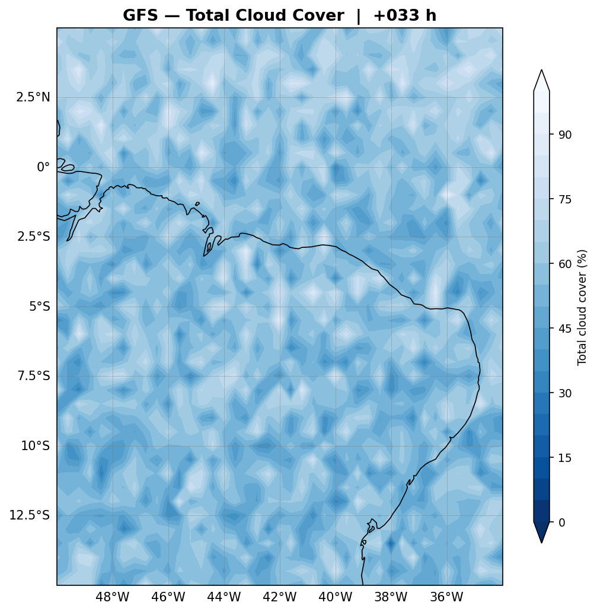
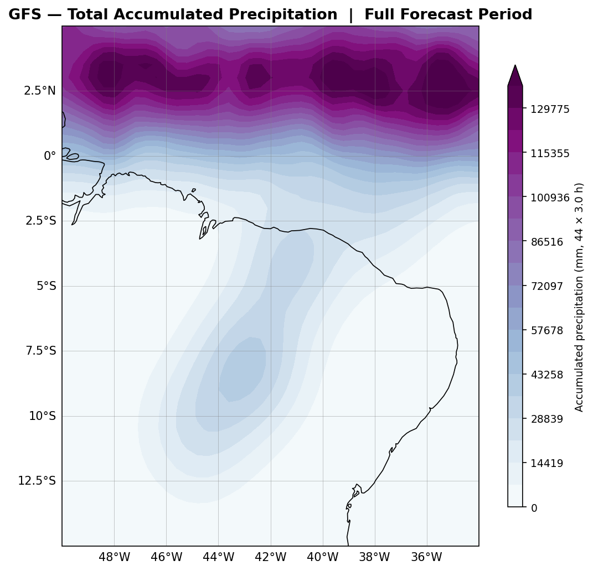
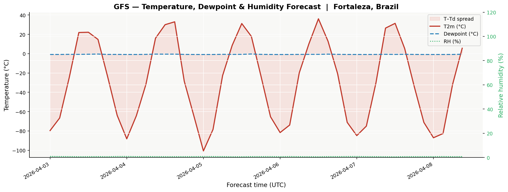
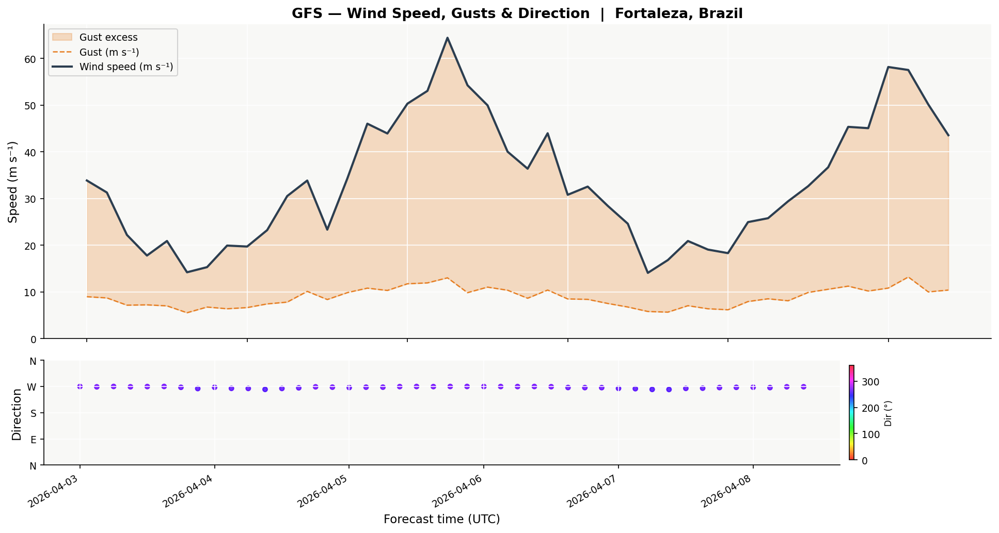
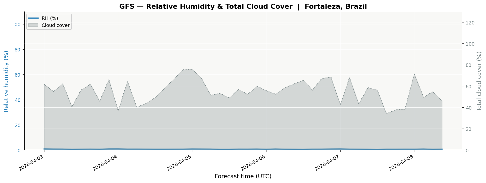
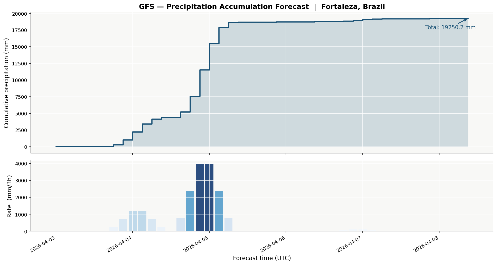
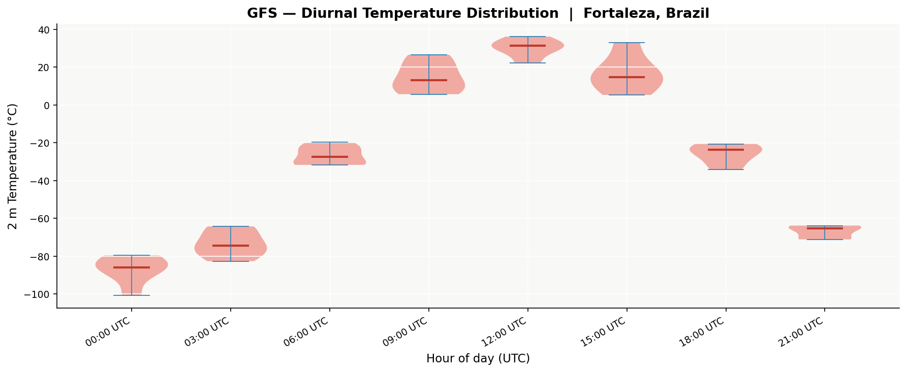
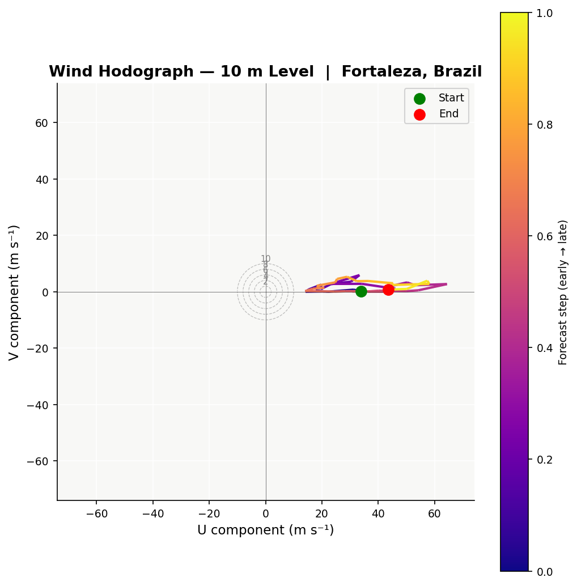
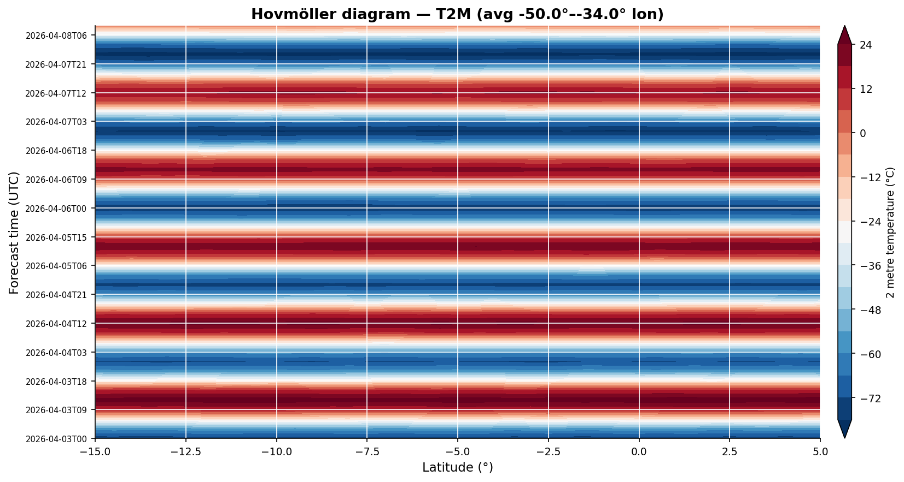
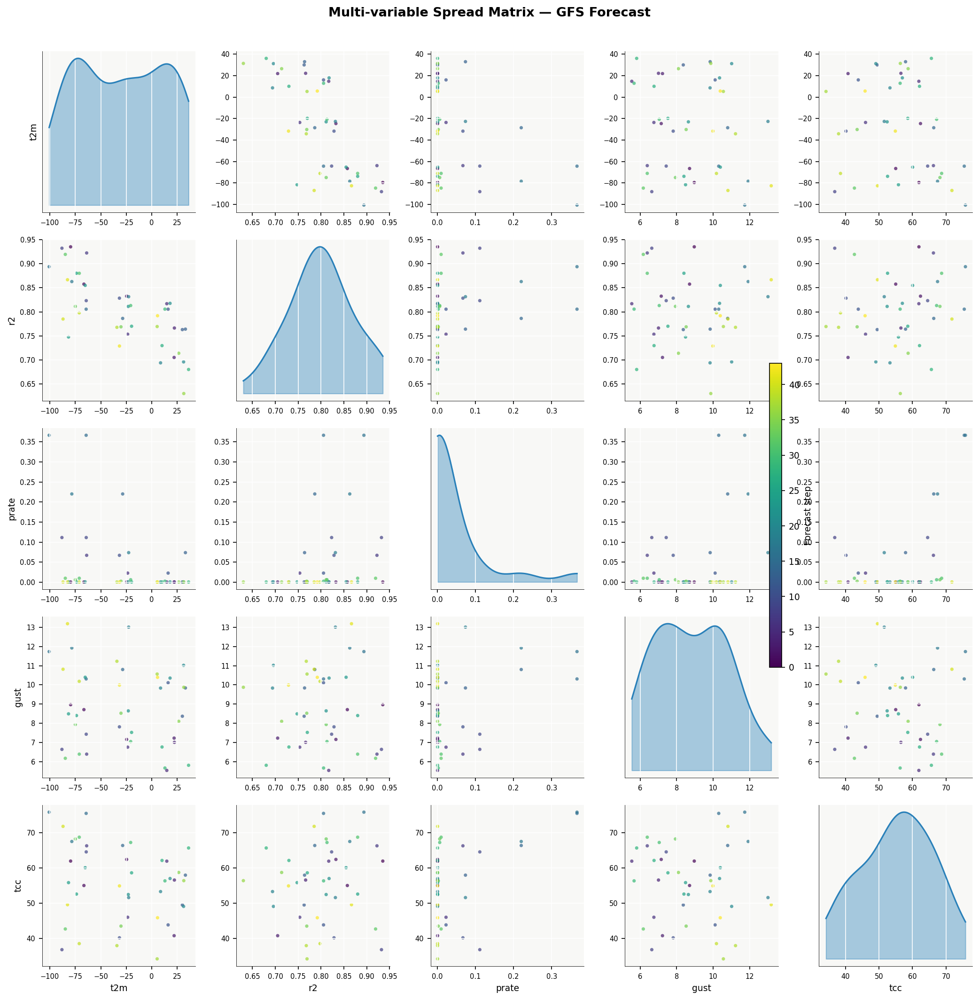

# Plot gallery

All 20 plots below are generated by `make_readme_plots.py` using synthetic
GFS data — no internet connection required to produce them.

Run it yourself:

```bash
python make_readme_plots.py
# → saves to gfs_plots/readme/
```

---

## GFS atmospheric plots

### Maps

<table>
<tr>
<td align="center" width="50%">
<b>01 · Synoptic surface map</b><br>
<sub>T2m filled · MSLP isobars · 10 m wind barbs</sub><br>

</td>
<td align="center" width="50%">
<b>02 · Wind speed map</b><br>
<sub>10 m wind speed fill + barbs at forecast hour</sub><br>

</td>
</tr>
<tr>
<td align="center">
<b>03 · Cloud cover map</b><br>
<sub>Total cloud cover fraction</sub><br>

</td>
<td align="center">
<b>04 · CAPE map</b><br>
<sub>Convective Available Potential Energy (J/kg)</sub><br>

</td>
</tr>
<tr>
<td align="center">
<b>05 · Accumulated precipitation map</b><br>
<sub>Total precipitation over a selected window</sub><br>

</td>
<td align="center">
<b>14 · 500 hPa geopotential + jet</b><br>
<sub>Geopotential height + wind speed at 500 hPa</sub><br>

</td>
</tr>
</table>

### City time series

<table>
<tr>
<td align="center" width="50%">
<b>06 · Temperature time series</b><br>
<sub>T2m + Dew point + MSLP + precipitation rate</sub><br>

</td>
<td align="center" width="50%">
<b>07 · Temperature & dew point</b><br>
<sub>T2m / Td with heat index shading</sub><br>

</td>
</tr>
<tr>
<td align="center">
<b>08 · Wind time series</b><br>
<sub>Wind speed + gust + direction barbs over time</sub><br>

</td>
<td align="center">
<b>09 · Humidity & cloud cover</b><br>
<sub>Relative humidity + total cloud fraction</sub><br>

</td>
</tr>
<tr>
<td align="center">
<b>10 · Cumulative precipitation</b><br>
<sub>Accumulated precip over forecast window</sub><br>

</td>
<td align="center">
<b>19 · Diurnal temperature distribution</b><br>
<sub>Violin plots by UTC hour</sub><br>

</td>
</tr>
</table>

### Specialised

<table>
<tr>
<td align="center" width="50%">
<b>11 · Wind rose</b><br>
<sub>Wind frequency by direction and speed category</sub><br>

</td>
<td align="center" width="50%">
<b>12 · Hodograph</b><br>
<sub>Wind vector rotation with height</sub><br>

</td>
</tr>
<tr>
<td align="center">
<b>13 · Vertical profiles</b><br>
<sub>T and RH at several forecast times vs pressure</sub><br>

</td>
<td align="center">
<b>15 · Hovmöller (longitude)</b><br>
<sub>Precipitation as a function of longitude × time</sub><br>

</td>
</tr>
<tr>
<td align="center">
<b>16 · Hovmöller (latitude)</b><br>
<sub>Temperature as a function of latitude × time</sub><br>

</td>
<td align="center">
<b>17 · Precipitation heatmap</b><br>
<sub>Daily rain by day of week and calendar date</sub><br>

</td>
</tr>
<tr>
<td align="center">
<b>18 · Spread matrix</b><br>
<sub>Pairwise scatter of surface variables</sub><br>

</td>
<td align="center">
<b>20 · Dashboard</b><br>
<sub>4-panel overview: T, wind, RH, precip</sub><br>

</td>
</tr>
</table>
